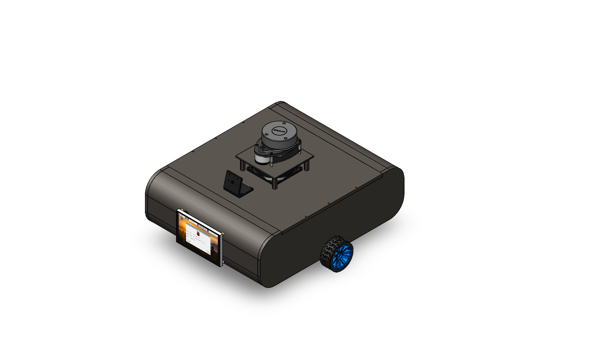
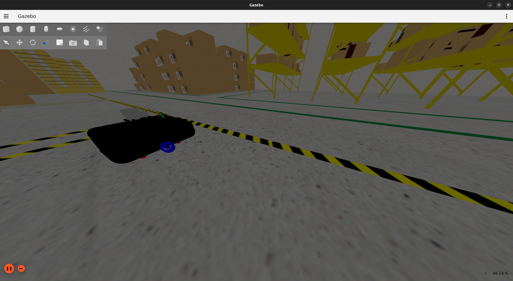
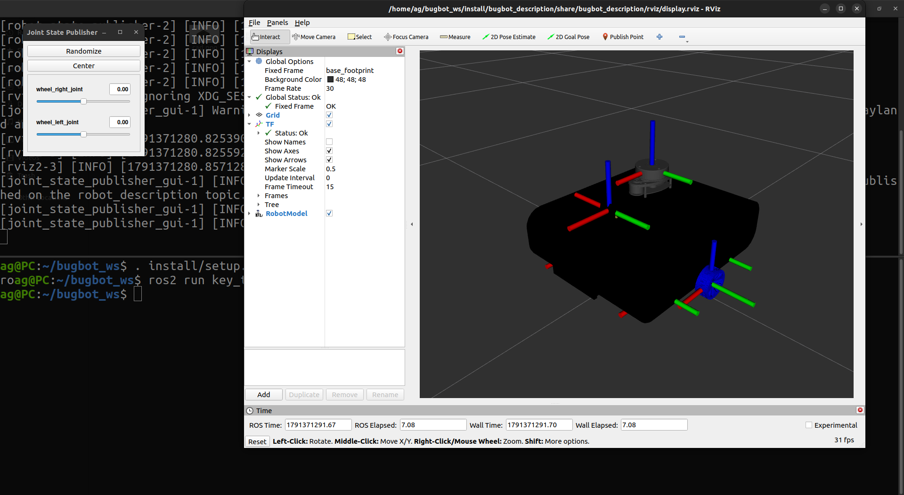
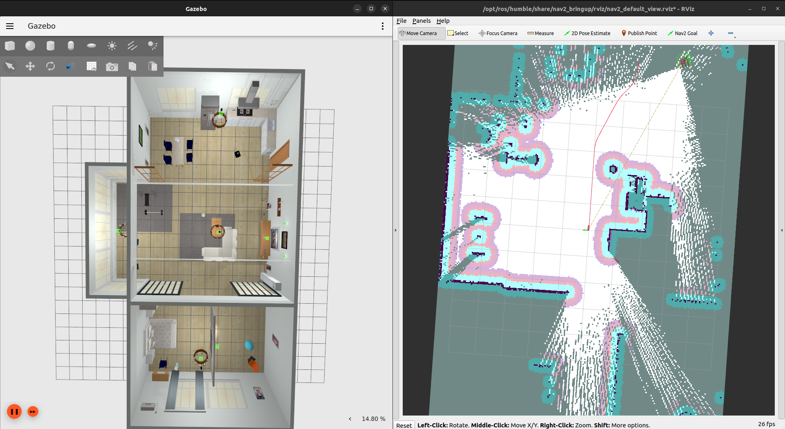
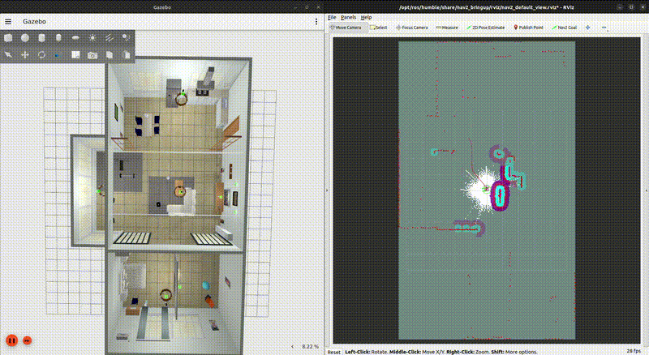
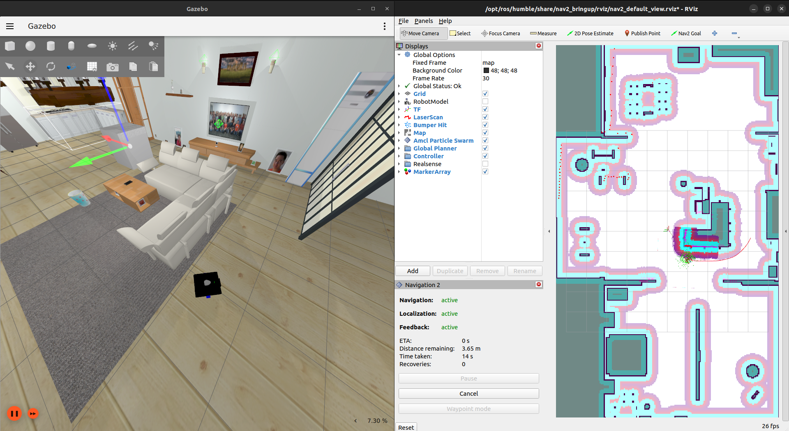
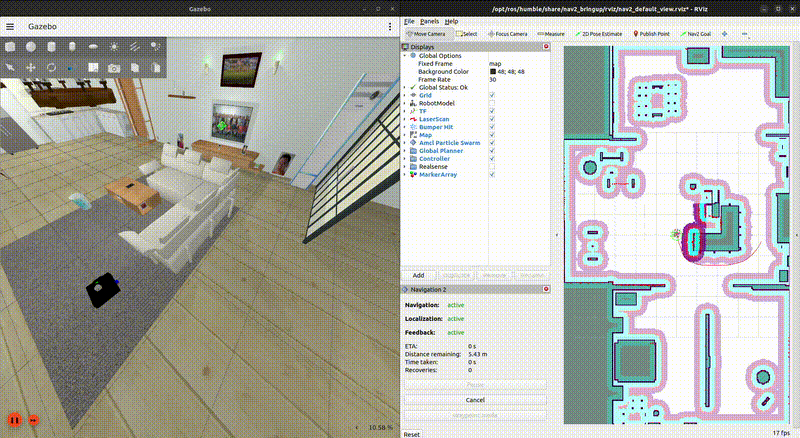

# Bug-Bot

**Bug-Bot** is the first autonomous mobile robot platform developed by **Raya Robotics**.

The platform is a modular **ROS 2-based autonomous mobile robot** integrating mechanical design, digital-twin simulation, differential-drive control, sensor fusion, SLAM, autonomous navigation, safety systems, and computer vision.

## Features

* Differential-drive mobile robot
* CAD-based robot description with URDF/Xacro
* Gazebo Sim digital-twin simulation
* ROS 2 Control and velocity control
* LiDAR, IMU, and RGB camera simulation
* Differential-drive odometry
* SLAM with **SLAM Toolbox**
* Global localization with **AMCL**
* Autonomous navigation with **Nav2**
* Behavior Tree-based navigation and recovery
* Joystick / teleoperation support
* Velocity multiplexing and safety stop
* ROS 2 Humble and newer ROS 2 distributions

## Architecture

```text
Bug-Bot
├── bugbot_description
│   ├── CAD / meshes / models
│   ├── URDF / Xacro
│   ├── Gazebo simulation
│   └── RViz configuration
│
├── bugbot_controller
│   ├── ros2_control
│   ├── diff_drive_controller
│   ├── joystick teleoperation
│   ├── twist_mux
│   └── velocity relay
│
├── bugbot_localization
│   └── AMCL
│
├── bugbot_mapping
│   └── SLAM Toolbox
│
├── bugbot_navigation
│   ├── Nav2
│   ├── Smac Planner
│   ├── Regulated Pure Pursuit
│   ├── Costmaps
│   └── Behavior Trees
│
└── bugbot_bringup
    └── System-level launch files
```

## Repository Structure

```text
bugbot_ws/
├── bash_scripts/
│   ├── map.pgm
│   ├── map.yaml
│   ├── navigation_sim.sh
│   └── slam_sim.sh
│
├── media/
│   ├── cad.gif
│   ├── cad.png
│   ├── gazebo.png
│   ├── navigation.gif
│   ├── navigation.png
│   ├── rviz.png
│   ├── slam.gif
│   └── slam.png
│
├── src/
│   ├── bugbot_bringup/
│   ├── bugbot_controller/
│   ├── bugbot_description/
│   ├── bugbot_localization/
│   ├── bugbot_mapping/
│   └── bugbot_navigation/
│
└── README.md
```

## Requirements

* Ubuntu 22.04 or compatible Linux environment
* ROS 2 Humble or newer
* Gazebo Sim / `ros_gz`
* Python 3
* `colcon`
* `rosdep`
* `xterm`

> **ROS 2 Humble:** Gazebo/Ignition integration uses the Ignition-compatible packages.
> **ROS 2 Iron and newer:** Gazebo Sim uses the newer `gz-*` packages.

## Installation

### 1. Clone the Repository

```bash
cd ~
git clone https://github.com/AhmedGaberAG/Bug-Bot.git bugbot_ws
cd ~/bugbot_ws
```

### 2. Install ROS 2 Dependencies

Set your ROS distribution:

```bash
export ROS_DISTRO=${ROS_DISTRO:-humble}
source /opt/ros/${ROS_DISTRO}/setup.bash
```

Install `rosdep` if required:

```bash
sudo apt update
sudo apt install -y python3-rosdep
```

Initialize `rosdep` if it has not been initialized:

```bash
sudo rosdep init
rosdep update
```

Install all package dependencies:

```bash
cd ~/bugbot_ws
rosdep install --from-paths src --ignore-src -r -y
```

### 3. Install Required System Packages

```bash
sudo apt install -y \
    build-essential \
    cmake \
    git \
    python3-pip \
    python3-colcon-common-extensions \
    python3-rosdep \
    xterm
```

### 4. Install Python Dependencies

```bash
python3 -m pip install --user \
    numpy \
    scipy
```

### 5. Build the Workspace

```bash
cd ~/bugbot_ws
source /opt/ros/${ROS_DISTRO}/setup.bash

colcon build --symlink-install
```

Source the workspace:

```bash
source ~/bugbot_ws/install/setup.bash
```

For convenience:

```bash
echo "source ~/bugbot_ws/install/setup.bash" >> ~/.bashrc
source ~/.bashrc
```

## Run the Simulation

### Full Simulation

Launch the complete Bug-Bot simulation:

```bash
ros2 launch bugbot_bringup simulated_robot.launch.py
```

The default configuration launches:

* Gazebo Sim
* Bug-Bot robot
* ROS 2 Control
* Differential-drive controller
* Joystick teleoperation
* AMCL localization
* Nav2 navigation
* RViz2

### SLAM Simulation

Start SLAM in the `small_house` world:

```bash
ros2 launch bugbot_bringup simulated_robot.launch.py \
    world_name:=small_house \
    use_slam:=true
```

Or use the provided script:

```bash
cd ~/bugbot_ws
./bash_scripts/slam_sim.sh
```

Save the generated map:

```text
save
```

or save it directly inside the workspace:

```text
save_inplace
```

### Navigation Simulation

After generating a map:

```bash
cd ~/bugbot_ws
./bash_scripts/navigation_sim.sh
```

Or launch directly:

```bash
ros2 launch bugbot_bringup simulated_robot.launch.py \
    world_name:=small_house
```

## Useful ROS 2 Commands

Check active nodes:

```bash
ros2 node list
```

Check topics:

```bash
ros2 topic list
```

Inspect LiDAR:

```bash
ros2 topic echo /scan
```

Inspect odometry:

```bash
ros2 topic echo /bugbot_controller/odom
```

Check TF:

```bash
ros2 run tf2_tools view_frames
```

Check controller status:

```bash
ros2 control list_controllers
```

## Media

### CAD




### Gazebo Simulation



### RViz2



### SLAM





### Autonomous Navigation





## Development

Build a specific package:

```bash
colcon build --packages-select bugbot_description
```

Build all packages:

```bash
colcon build --symlink-install
```

After modifying Python launch/config files:

```bash
source ~/bugbot_ws/install/setup.bash
```

## License

This project is developed by **Raya Robotics** for research, development, and autonomous robotics applications.

